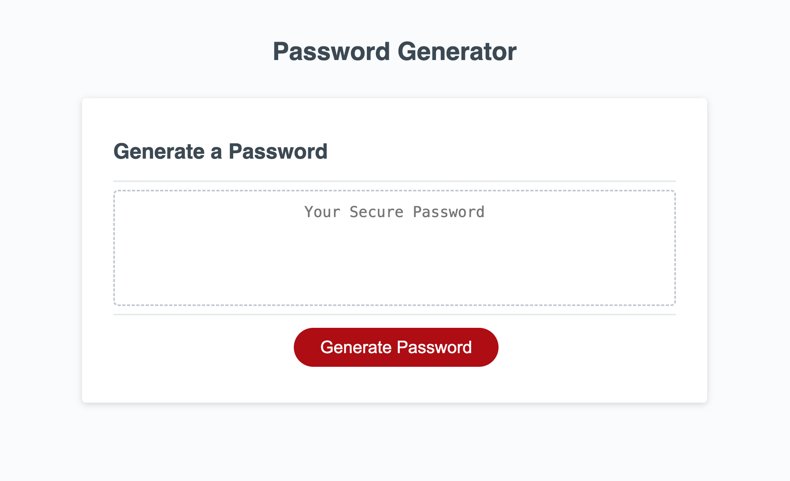
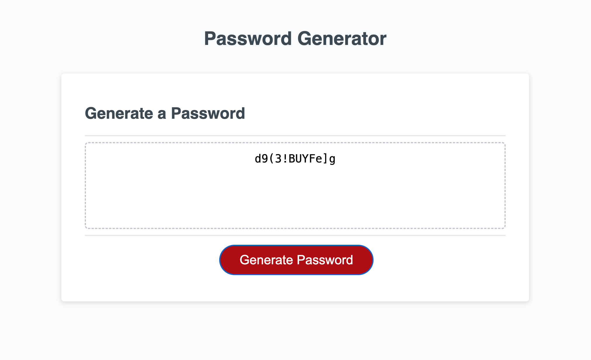

# Password-Generator
An application that can be used to generate a random password based on selected criteria.

## Description

This assignment was to create an application that an employee can use to generate a random password based on criteria they’ve selected. This app should run in the browser and feature dynamically updated HTML and CSS powered by JavaScript code written by me.

### Tasks completed

* JavaScript code written for an application that generates a random password based on the selection of the following criteria:
- number of characters (between 8-128)
- uppercase letters
- lowercase letters
- numerical characters
- special characters

#### Screenshots

##### Acknowledgements

This code was written with some assistance from Corey Yates, tutor at EdX.

###### Links

Deployed website: (https://lianna87.github.io/Password-Generator/)

Code repository:(https://github.com/Lianna87/Password-Generator)

